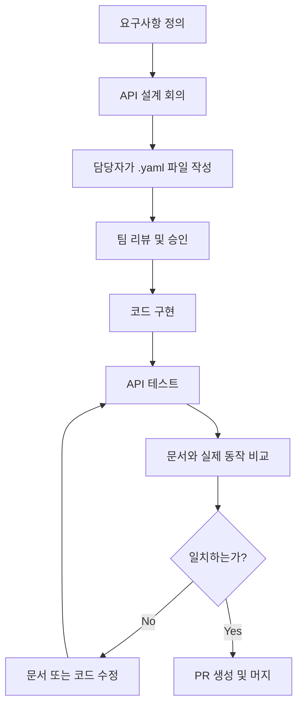
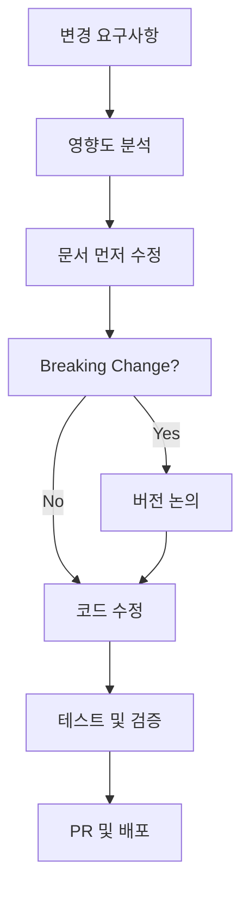

# 🤝 협업을 위한 API 문서화 가이드

## 📋 목차
1. [빠른 시작](#빠른-시작)
2. [문서 구조](#문서-구조)
3. [협업 규칙](#협업-규칙)
4. [개발 워크플로우](#개발-워크플로우)
5. [문제 해결](#문제-해결)

## 🚀 빠른 시작

### 1단계: 환경 설정
```bash
# 프로젝트 클론 후
cd MAI_Help_You/docs

# Node.js 환경 (추천)
chmod +x scripts/setup.sh
./scripts/setup.sh

# 또는 Python 환경
python scripts/serve-docs.py
```

### 2단계: 문서 확인
- **Swagger UI**: `npm run docs:serve` → http://localhost:3001
- **간단 확인**: `python scripts/serve-docs.py` → http://localhost:3001
- **빌드 테스트**: `npm run docs:build`

### 3단계: 개발 시작
1. 담당 기능의 `.yaml` 파일 확인
2. API 변경 시 문서 먼저 업데이트
3. PR 전에 `npm run docs:validate` 실행

## 📁 문서 구조

```
docs/
├── README.md                    # 기본 사용법
├── COLLABORATION_GUIDE.md       # 이 파일 - 협업 가이드
├── package.json                 # Node.js 도구 설정
├── api/                        # API 명세서들
│   ├── openapi.yaml            # 🎯 메인 통합 명세서
│   ├── auth.yaml               # 인증/로그인 (@sns_login 담당자)
│   ├── chatbot.yaml            # 챗봇 대화 (@chatbot 담당자)
│   ├── character.yaml          # 캐릭터 정보 (@character_info 담당자)
│   ├── main.yaml               # 메인 페이지 (@main_page 담당자)
│   └── fastapi.yaml            # AI 모델 서비스 (@AI 담당자)
├── schemas/                    # 공통 스키마
│   ├── common.yaml             # 공통 응답/파라미터
│   └── models.yaml             # 데이터 모델 정의
├── scripts/                    # 도구 스크립트
│   ├── setup.sh                # 환경 설정
│   └── serve-docs.py           # Python 서버
├── postman/                    # Postman 컬렉션 (자동 생성)
└── build/                      # 빌드 결과물 (자동 생성)
```

## 🎯 담당자별 역할

| 담당 영역 | 파일 | 담당자 | 주요 API |
|----------|------|--------|----------|
| **인증 시스템** | `auth.yaml` | @sns_login | 로그인, 로그아웃, 토큰 |
| **챗봇 대화** | `chatbot.yaml` | @chatbot | 질문/답변, 히스토리 |
| **캐릭터 정보** | `character.yaml` | @character_info | 캐릭터 조회/검색 |
| **메인 페이지** | `main.yaml` | @main_page | 공지사항, 이벤트 |
| **AI 모델** | `fastapi.yaml` | @AI | 모델 직접 호출 |
| **통합 관리** | `openapi.yaml` | @팀장 | 전체 구조 관리 |

## 📝 협업 규칙

### ✅ 해야 할 것
1. **API 변경 전 문서 먼저 작성**
   ```bash
   # 예: 새 엔드포인트 추가 시
   1. docs/api/chatbot.yaml 수정
   2. npm run docs:validate 확인
   3. 코드 구현
   4. 테스트 후 PR
   ```

2. **커밋 메시지 규칙**
   ```bash
   docs: chatbot API에 스트리밍 응답 추가
   docs: character 검색 파라미터 수정
   fix: auth API 응답 스키마 오타 수정
   ```

3. **PR 체크리스트**
   - [ ] 해당 .yaml 파일 업데이트 완료
   - [ ] `npm run docs:validate` 통과
   - [ ] 실제 API와 문서 일치 확인
   - [ ] 예시 요청/응답 업데이트

### ❌ 하지 말아야 할 것
1. **구현 후 문서 작성** (문서 동기화 누락 위험)
2. **다른 팀원 담당 파일 무단 수정**
3. **openapi.yaml 직접 수정** (통합 담당자와 협의)
4. **검증 없이 PR** (`docs:validate` 실패 시 머지 금지)

## 🔄 개발 워크플로우

### 새로운 API 개발 시


### 기존 API 수정 시


## 🛠️ 개발 도구 활용

### 1. 실시간 문서 확인
```bash
# 백그라운드에서 문서 서버 실행
npm run docs:serve &

# 코드 수정하면서 브라우저에서 http://localhost:3001 확인
# 파일 저장 시 자동 새로고침
```

### 2. API 테스트
```bash
# Postman 컬렉션 생성
npm run postman:convert

# 생성된 파일: postman/MAI_Chatbot.postman_collection.json
# Postman에서 Import하여 API 테스트
```

### 3. 문서 품질 관리
```bash
# 문법 검사
npm run docs:validate

# 정적 문서 빌드
npm run docs:build

# 번들링 (배포용)
npm run docs:bundle
```

### 4. VS Code 확장 권장
- **OpenAPI (Swagger) Editor**: YAML 문법 검사 및 미리보기
- **YAML**: YAML 파일 문법 하이라이팅
- **REST Client**: `.http` 파일로 API 테스트

## 🔍 문제 해결

### 자주 발생하는 오류

#### 1. `$ref` 경로 오류
```yaml
# ❌ 잘못된 경로
$ref: './common.yaml#/components/schemas/User'

# ✅ 올바른 경로
$ref: '../schemas/common.yaml#/components/schemas/User'
```

#### 2. YAML 문법 오류
```bash
# 검증 도구 실행
npm run docs:validate

# 오류 위치와 내용 확인
# 대부분 들여쓰기 또는 특수문자 이스케이프 문제
```

#### 3. 순환 참조 (Circular Reference)
```yaml
# ❌ A가 B를 참조하고 B가 A를 참조
UserSchema:
  $ref: '#/components/schemas/Profile'
ProfileSchema:
  $ref: '#/components/schemas/User'  # 순환 참조!

# ✅ 공통 스키마로 분리
BaseUser:
  type: object
  properties:
    id: { type: integer }
```

### 개발 환경별 가이드

#### Node.js 없는 환경
```bash
# Python만으로 간단 확인
python docs/scripts/serve-docs.py

# 또는 Django 개발 서버에서 정적 파일로 서빙
python manage.py collectstatic
# static/docs/ 디렉토리에 배치
```

#### Windows 환경
```cmd
REM Git Bash 또는 WSL 사용 권장
bash docs/scripts/setup.sh

REM 또는 PowerShell에서
npm install -g @redocly/cli
cd docs
npm run docs:serve
```

## 📞 지원 및 문의

### 문서 관련 이슈
1. **GitHub Issues**: API 문서 버그나 개선사항
2. **팀 Slack**: `#api-docs` 채널
3. **코드 리뷰**: PR에서 `@docs-reviewer` 멘션

### 긴급한 문제
- **문서 서버 다운**: Python 서버로 대체 사용
- **빌드 실패**: `.yaml` 파일 문법 검사
- **API 불일치**: 해당 담당자와 즉시 동기화

## 📚 참고 자료

- [OpenAPI 3.0 명세](https://spec.openapis.org/oas/v3.0.3)
- [Redocly CLI 문서](https://redocly.com/docs/cli/)
- [YAML 문법 가이드](https://yaml.org/spec/1.2.2/)
- [Swagger UI 사용법](https://swagger.io/tools/swagger-ui/)

---

**📝 이 가이드는 팀의 협업 효율성을 높이기 위해 작성되었습니다.**  
**궁금한 점이나 개선사항이 있으면 언제든 제안해주세요! 🚀**
